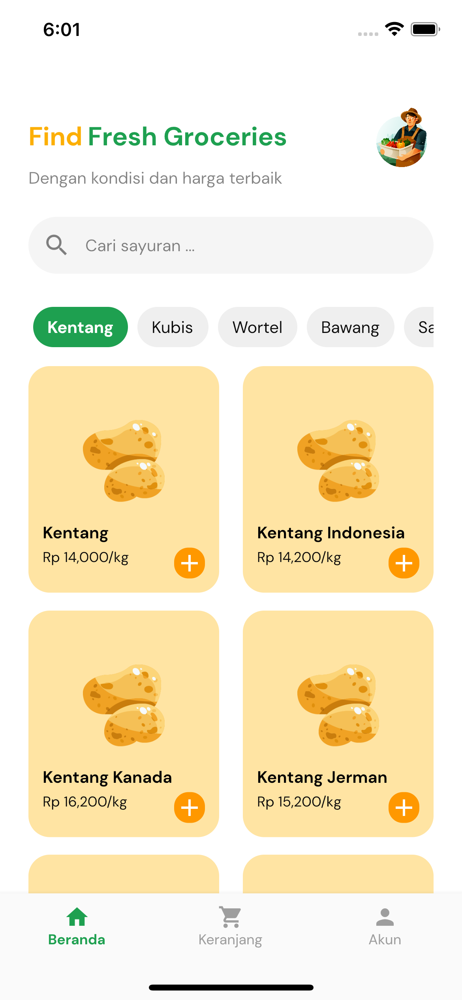
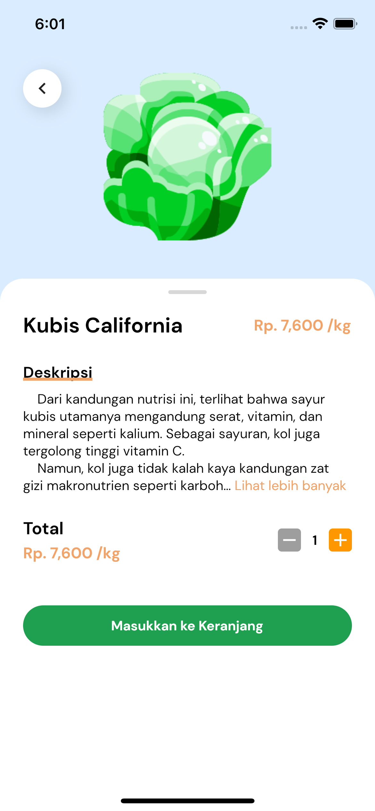
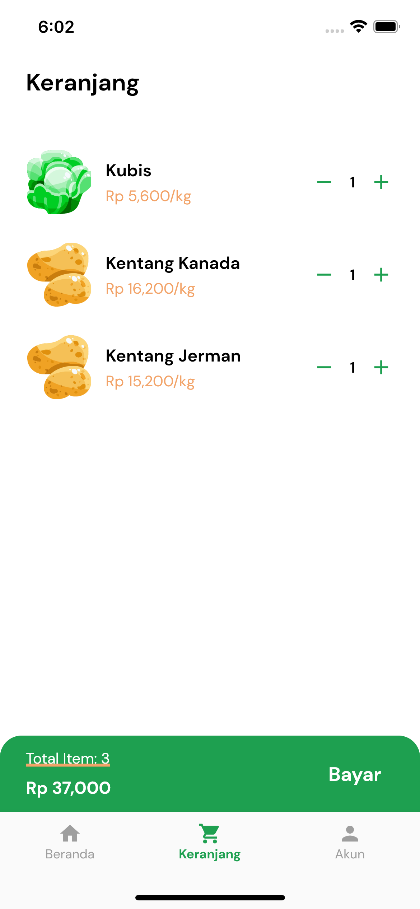
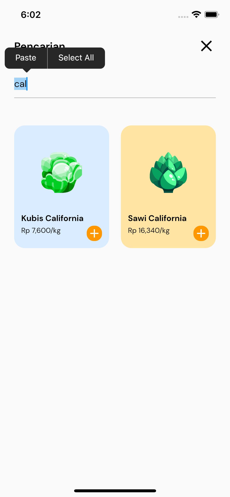

# KlikDaily 🍅 Technical Test

this app for technical test @klikdaily build with flutter 2.10.1 and clean architecture
support to running in ios and android

<br>

## Flow and Description for this app 👈
[Figma Design for flow](https://www.figma.com/file/Ql5tRBhfMWbHsazxiqhhaF/Untitled?node-id=0%3A1)

<br>

## Download Apk ⬇️
[Google Drive](https://drive.google.com/file/d/1CmoTYGkeSgr_ln4RIrH-urKykXwyMewm/view?usp=sharing)


<br>

## Preview

| Home Page | Detail Page | Cart page | Search Page| |
| ----- | ----- | ----- | ------ | ----- |
| |  |  |  |


## Step to running project

1. Installing Package

```
flutter pub get
```

2. Running Project with Simulator ios or Android Emulator

```
flutter run
```


## Packges

- http: ^0.13.3
- dartz: ^0.10.0-nullsafety.2
- equatable: ^2.0.3
- get_it: ^7.1.3
- flutter_bloc: ^8.0.1
- sqflite_sqlcipher: ^2.1.0
- encrypt: ^5.0.1
- intl: ^0.17.0
- readmore: ^2.1.0
- lottie: ^1.2.1
- intro_slider: ^3.0.


<br>

## Credits
Copyright © 2022 Mufkhalif

Build With 💙
